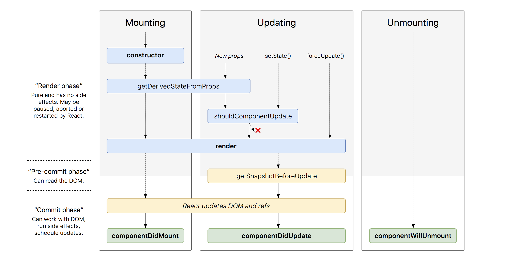

# 跟vue相比咋样？

- 本质区别：react只是libray，而不是framework（这句话是react自己说的，虽然不太懂这是啥意思）
- 数据渲染：
  - vue直接是双向绑定（响应式数据渲染），数据更新导致UI渲染这块开发者不需要操心
  - react则是对state进行操作来重新render
  - 他俩的状态改变引起的重新渲染都会有异步，大概是为了性能考虑吧

# component

详见[react官方文档](https://reactjs.org/docs/react-component.html)

## The Component Lifecycle

Each component has several “lifecycle methods” that you can override to run code at particular times in the process. **You can use [this lifecycle diagram](http://projects.wojtekmaj.pl/react-lifecycle-methods-diagram/) as a cheat sheet.** In the list below, commonly used lifecycle methods are marked as **bold**. The rest of them exist for relatively rare use cases.



### Mounting

These methods are called in the following order when an instance of a component is being created and inserted into the DOM:

- [**`constructor()`**](https://reactjs.org/docs/react-component.html#constructor)
- [`static getDerivedStateFromProps()`](https://reactjs.org/docs/react-component.html#static-getderivedstatefromprops)
- [**`render()`**](https://reactjs.org/docs/react-component.html#render)
- [**`componentDidMount()`**](https://reactjs.org/docs/react-component.html#componentdidmount)

> Note:
>
> These methods are considered legacy and you should [avoid them](https://reactjs.org/blog/2018/03/27/update-on-async-rendering.html) in new code:
>
> - [`UNSAFE_componentWillMount()`](https://reactjs.org/docs/react-component.html#unsafe_componentwillmount)

### Updating

An update can be caused by changes to props or state. These methods are called in the following order when a component is being re-rendered:

- [`static getDerivedStateFromProps()`](https://reactjs.org/docs/react-component.html#static-getderivedstatefromprops)
- [`shouldComponentUpdate()`](https://reactjs.org/docs/react-component.html#shouldcomponentupdate)
- [**`render()`**](https://reactjs.org/docs/react-component.html#render)
- [`getSnapshotBeforeUpdate()`](https://reactjs.org/docs/react-component.html#getsnapshotbeforeupdate)
- [**`componentDidUpdate()`**](https://reactjs.org/docs/react-component.html#componentdidupdate)

> Note:
>
> These methods are considered legacy and you should [avoid them](https://reactjs.org/blog/2018/03/27/update-on-async-rendering.html) in new code:
>
> - [`UNSAFE_componentWillUpdate()`](https://reactjs.org/docs/react-component.html#unsafe_componentwillupdate)
> - [`UNSAFE_componentWillReceiveProps()`](https://reactjs.org/docs/react-component.html#unsafe_componentwillreceiveprops)

### Unmounting

This method is called when a component is being removed from the DOM:

- [**`componentWillUnmount()`**](https://reactjs.org/docs/react-component.html#componentwillunmount)

### Error Handling

These methods are called when there is an error during rendering, in a lifecycle method, or in the constructor of any child component.

- [`static getDerivedStateFromError()`](https://reactjs.org/docs/react-component.html#static-getderivedstatefromerror)
- [`componentDidCatch()`](https://reactjs.org/docs/react-component.html#componentdidcatch)

## Functional component

## Class component

# setstate

## Introducing `setState()`

`setState()` schedule changes to the component’s state object and tells React that this component and its children need to be re-rendered with the update state:

```
// Correct
this.setState({name: 'Obaseki Nosa'});
```

React intentionally “waits” until all components call `setState()` in their event handlers before starting to re-render. This boosts performance by avoiding unnecessary re-renders.

Know that `setState()` can be considered as a request instead of an immediate command to update the component.

This is why trying to use `this.state` immediately after a `setState()` would lead to incorrect behaviors:

```
// Trying to change the value of this.state.count from previous example
this.setState({
  count: 4
});

console.log(this.state.count); // 0
```

`this.state.count` returns `0` because even though the value has been set with `setState()`, it was only scheduled and yet to be re-rendered before attempting to use the value with `this.state`.

`setState()` will always lead to a re-render unless `shouldComponentUpdate()` returns `false`.

## Using `setState()` in React lifecycle methods

Calling `setState()` in React’s lifecycle methods requires a certain level of caution. There are a few methods where calling `setState()` would lead to undesirable results and others where it should be avoided completely.

### `render()`

Calling `setState()` here makes your component a contender for producing infinite loops.

The `render()` function should be pure, meaning that it does not modify component state, it returns the same result each time it’s invoked, and it does not directly interact with the browser.

In this case, avoid using `setState()` here.

### `constructor()`

You should not call `setState()` in the `constructor()`. Instead, if your component needs to use local state, assign the initial state to `this.state` directly in the constructor.

### `componentDidMount()`

`componentDidMount()` is invoked immediately after a component is mounted. You may call `setState()` immediately in `componentDidMount()`. It will trigger an extra rendering, but it will happen before the browser updates the screen thus `render()` will be called twice.

### `componentDidUpdate()`

`componentDidUpdate()` is invoked immediately after updating occurs. You **may call `setState()` immediately** here, but know that **it must be wrapped in a condition** like in the example below, or you’ll cause an infinite loop:

```
componentDidUpdate(prevProps, prevState) {
  let newName = 'Obaseki Nosa'
  // Don't forget to compare states
  if (prevState && prevState.name !== newName) {
    this.setState({name: newName});
  }
}
```

### `componentWillUnmount()`

You **should not call `setState()` here** because the component will never be re-rendered. Once a component instance is unmounted, it will never be mounted again.

## Conclusion

1. `setState()` is async, meaning there is no guarantee that the state has been updated if we try to access the value immediately

2. You can only change `state` with `setState` and **React will react** to the change

3. Avoid confusing the  `state` object with other instance properties. It’s easy to assume you can define another object in the constructor and try to use it like

     `state`, but the `state` instance is a special one because React will manage it:


# props.children

> https://zh-hans.reactjs.org/docs/composition-vs-inheritance.html

组件嵌套的另类写法：

```
function FancyBorder(props) {
  return (
    <div className={'FancyBorder FancyBorder-' + props.color}>
      {props.children}
    </div>
  );
}

function WelcomeDialog() {
  return (
    <FancyBorder color="blue">
      <h1 className="Dialog-title">
        Welcome
      </h1>
      <p className="Dialog-message">
        Thank you for visiting our spacecraft!
      </p>
    </FancyBorder>
  );
}
```

但不好的是，这种写法导致所有子内容都是外面传进来的，FancyBorder自己没有。针对这个问题，下面是留下几个‘洞’的写法：（其实这种写法就相当于通过props把子组件传进去，不如上面的稀奇）

# Fragment

```
render() {
  return (
    <React.Fragment>
      <ChildA />
      <ChildB />
      <ChildC />
    </React.Fragment>
  );
}
```

就是上述写法，根部不用\<div>而是<React.Fragment>，这样返回的列表就可以不被\<div>包裹

# redux

- UI
- action
- reducer
- store
- dispatch
- subscribe

# react-redux

> [阮一峰：react-redux](https://www.ruanyifeng.com/blog/2016/09/redux_tutorial_part_three_react-redux.html)

但里面很多东西都更新了，例如connect()就可以接受四个参数：

```
@param mapStateToProps
@param mapDispatchToProps
@param mergeProps
@param options
```

其实react-redux就只是专门为react使用redux添加了专门的api。

## 源码阅读：

- react-redux做了什么？
- 如何做？


# HOOK

- [基础 Hook](https://zh-hans.reactjs.org/docs/hooks-reference.html#basic-hooks)
  - [`useState`](https://zh-hans.reactjs.org/docs/hooks-reference.html#usestate)
  - [`useEffect`](https://zh-hans.reactjs.org/docs/hooks-reference.html#useeffect)
  - [`useContext`](https://zh-hans.reactjs.org/docs/hooks-reference.html#usecontext)
- [额外的 Hook](https://zh-hans.reactjs.org/docs/hooks-reference.html#additional-hooks)
  - [`useReducer`](https://zh-hans.reactjs.org/docs/hooks-reference.html#usereducer)
  - [`useCallback`](https://zh-hans.reactjs.org/docs/hooks-reference.html#usecallback)
  - [`useMemo`](https://zh-hans.reactjs.org/docs/hooks-reference.html#usememo)
  - [`useRef`](https://zh-hans.reactjs.org/docs/hooks-reference.html#useref)
  - [`useImperativeHandle`](https://zh-hans.reactjs.org/docs/hooks-reference.html#useimperativehandle)
  - [`useLayoutEffect`](https://zh-hans.reactjs.org/docs/hooks-reference.html#uselayouteffect)
  - [`useDebugValue`](https://zh-hans.reactjs.org/docs/hooks-reference.html#usedebugvalue)

## useEffect

> [overreactted: useEffect](https://overreacted.io/zh-hans/a-complete-guide-to-useeffect/)


# Context(redux中provider依赖其实现)


# Fiber

# React.memo

在react里面render是很大的开销，在开发过程中我们应该避免不必要的render。举个例子，当一个父组件render时，子组件也会被重新render，即使传过去的props没有改变。解决方案之一就是React.memo

```
// ...
export default React.memo(Child);
```

但是是专门给 **Function Component** 提供的，对 **Class Component **并不适用。

首先看下 React.memo() 的使用方式：

```text
function MyComponent(props) {
  /* render using props */
}
function areEqual(prevProps, nextProps) {
  /*
  return true if passing nextProps to render would return
  the same result as passing prevProps to render,
  otherwise return false
  */
}
export default React.memo(MyComponent, areEqual);
```

使用方式很简单，在 Function Component 之外，在声明一个 areEqual 方法来判断两次 props 有什么不同，如果第二个参数不传递，则默认只会进行 props 的**浅比较**。

最终 export 的组件，就是 React.memo() 包装之后的组件。

`React.memo` 仅检查 props 变更。如果函数组件被 `React.memo` 包裹，且其实现中拥有 [`useState`](https://zh-hans.reactjs.org/docs/hooks-state.html) 或 [`useContext`](https://zh-hans.reactjs.org/docs/hooks-reference.html#usecontext) 的 Hook，当 context 发生变化时，它仍会重新渲染。

## useMemo

而在某些场景下，我们只是希望 component 的部分不要进行 re-render，而不是整个 component 不要 re-render，也就是要实现 `局部 Pure` 功能（可真矫情:weary:）。


# ref

- React.cerateRef
- Recat.forwardRef

# React.lazy + react.Suspense

```
// 该组件是动态加载的
const OtherComponent = React.lazy(() => import('./OtherComponent'));

function MyComponent() {
  return (
    // 显示 <Spinner> 组件直至 OtherComponent 加载完成
    <React.Suspense fallback={<Spinner />}>
      <div>
        <OtherComponent />
      </div>
    </React.Suspense>
  );
}
```

