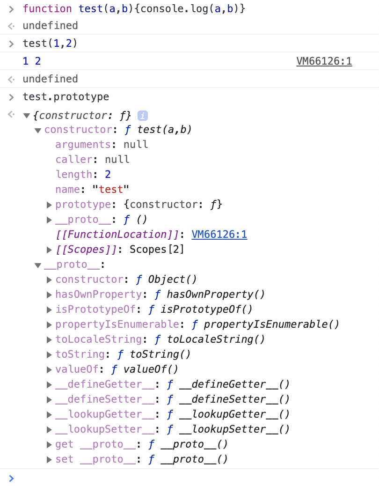
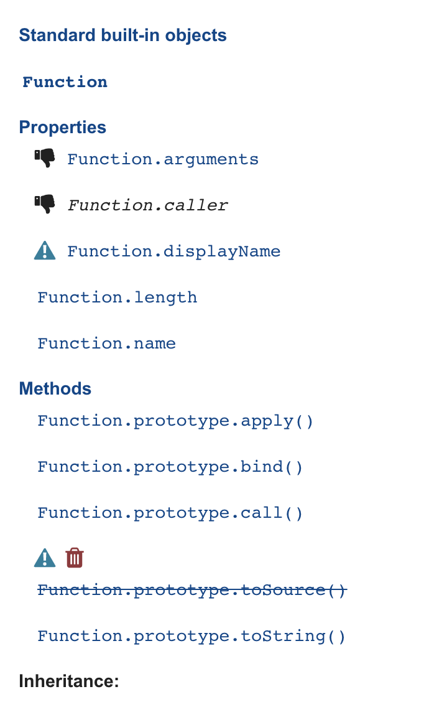
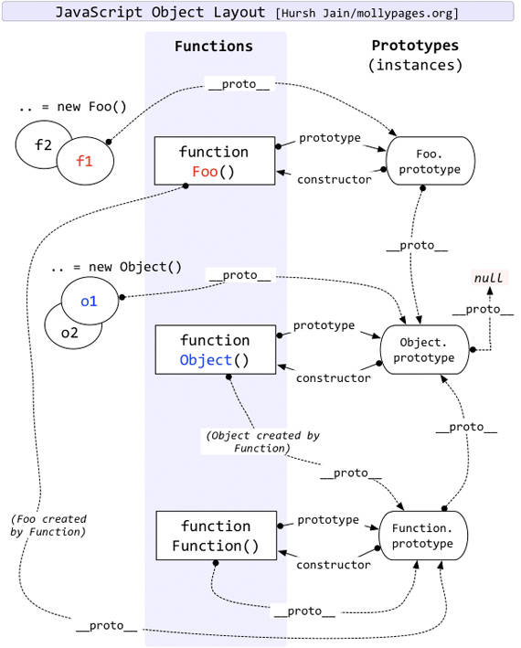

# redux介绍

> [阮一峰老师的扫盲](http://www.ruanyifeng.com/blog/2016/09/redux_tutorial_part_one_basic_usages.html)

- state

  整个redux的数据都存在store里，而state就是store在某个时刻的快照（状态）

  `store.getState()`

- action

  状态可以被改变，action就是view发出的通知（也仅仅是通知，或是携带部分信息），是一个对象

  ```
  const action = {
  	// 必须的，作为action的标识
  	type: 'ADD_TODO',
  	// 携带的信息，用于替换redux中的数据，所以很重要
    // question：
    payload: 'Learn Redux' 
  };
  ```

  view发出action：`store.dispatch(action)`

- reducer

  通过收到的action和旧的state，替换成新的state（说成更新state不太好，理由如下）

  > 阮一峰老师：
  >
  > 由于 Reducer 是纯函数，就可以保证同样的State，必定得到同样的 View。但也正因为这一点，Reducer 函数里面不能改变 State，必须返回一个全新的对象
  >
  > 最好把 State 对象设成只读。你没法改变它，要得到新的 State，唯一办法就是生成一个新对象。这样的好处是，任何时候，与某个 View 对应的 State 总是一个不变的对象。

- subscribe

  question：view发action改变state，state的改变怎么通知到所有使用了state的view呢？

  answer：view方面做出订阅：`store.subscribe`

  详见阮一峰老师的讲解

- 其他，reducer拆分，中间件（异步）啥的，请见[阮一峰：Redux 入门教程（二）：中间件与异步操作](http://www.ruanyifeng.com/blog/2016/09/redux_tutorial_part_two_async_operations.html)

有关redux的介绍这里就不再赘述，阮一峰老师讲解的很好，想看一些精简demo请移步[redux源码](https://github.com/reduxjs/redux)，上面不仅贴了各类examples还有疑难解答甚至心路历程，是我碰到过的最亲切的源码了:book:

想要了解redux起源的同学可以去参考flux或是github上开发者资料，例如这哥们[acdlite](https://github.com/acdlite)

# redux中让人困惑的点

fork源码分析，这里列出一些question

## build

`src/index.ts:`

```typescript
/*
 * This is a dummy function to check if the function name has been altered by minification.
 * If the function has been minified and NODE_ENV !== 'production', warn the user.
 */
function isCrushed() {}

if (
  process.env.NODE_ENV !== 'production' &&
  typeof isCrushed.name === 'string' &&
  isCrushed.name !== 'isCrushed'
) {
  warning(
    'You are currently using minified code outside of NODE_ENV === "production". ' +
      'This means that you are running a slower development build of Redux. ' +
      'You can use loose-envify (https://github.com/zertosh/loose-envify) for browserify ' +
      'or setting mode to production in webpack (https://webpack.js.org/configuration/mode/) ' +
      'to ensure you have the correct code for your production build.'
  )
}
```

这是我看redux的第一个文件，第一眼就被震住了，声明了一个空函数isCrushed，然后用函数名做检查？？？

好在它只是个warning:dog:，而且文件里写了注释和warning内容，大致就是当代码被压缩或是没在生产环境，就弹出warning。函数名就可以用来检查代码是否被压缩过，具体细节可以使用webpack自己捣鼓一下，webpack4现在打包也是默认就压缩js。

我个人还是比较好奇`isCrushed.name`是哪来的

<div>
  
  
</div>


每个函数都是Function类型的实例（红宝书p110），emm，又学到了，原来function里边里有这些东西

- arguments，类数组对象，里面是传进来的参数，箭头函数没有arguments（但是我用node跑能输出？？虽然我也不认识输出的啥）
- caller，如果一个函数`f`是在全局作用域内被调用的,则`f.caller`为`null`,相反,如果一个函数是在另外一个函数作用域内被调用的,则`f.caller`指向调用它的那个函数.（MDN）
- length，函数希望接受的命名参数的个数（红宝书p116），???js又不对参数进行检查啥的
- name，函数名
- 原型链啥的，作用域啥的，略过
- [[FunctionLocation]]: VM53:1，emm，在目前我的眼里，啥js引擎、虚拟机、运行时环境统称‘环境’，不知道有没有纠正我错误观念的那天


## overload

`src/applyMiddleware.ts`

```
import ...省略引用

/**
 * ...省略注释
 */
export default function applyMiddleware(): StoreEnhancer
export default function applyMiddleware<Ext1, S>(
  middleware1: Middleware<Ext1, S, any>
): StoreEnhancer<{ dispatch: Ext1 }>
export default function applyMiddleware<Ext1, Ext2, S>(
  middleware1: Middleware<Ext1, S, any>,
  middleware2: Middleware<Ext2, S, any>
): StoreEnhancer<{ dispatch: Ext1 & Ext2 }>
export default function applyMiddleware<Ext1, Ext2, Ext3, S>(
  middleware1: Middleware<Ext1, S, any>,
  middleware2: Middleware<Ext2, S, any>,
  middleware3: Middleware<Ext3, S, any>
): StoreEnhancer<{ dispatch: Ext1 & Ext2 & Ext3 }>
export default function applyMiddleware<Ext1, Ext2, Ext3, Ext4, S>(
  middleware1: Middleware<Ext1, S, any>,
  middleware2: Middleware<Ext2, S, any>,
  middleware3: Middleware<Ext3, S, any>,
  middleware4: Middleware<Ext4, S, any>
): StoreEnhancer<{ dispatch: Ext1 & Ext2 & Ext3 & Ext4 }>
export default function applyMiddleware<Ext1, Ext2, Ext3, Ext4, Ext5, S>(
  middleware1: Middleware<Ext1, S, any>,
  middleware2: Middleware<Ext2, S, any>,
  middleware3: Middleware<Ext3, S, any>,
  middleware4: Middleware<Ext4, S, any>,
  middleware5: Middleware<Ext5, S, any>
): StoreEnhancer<{ dispatch: Ext1 & Ext2 & Ext3 & Ext4 & Ext5 }>
export default function applyMiddleware<Ext, S = any>(
  ...middlewares: Middleware<any, S, any>[]
): StoreEnhancer<{ dispatch: Ext }>
export default function applyMiddleware(
  ...middlewares: Middleware[]
): StoreEnhancer<any> {
  ...省略内部逻辑
}
```

不知ts有函数重载的我又被吓住了

Question:为什么js没有overload？

answer：

1.动态语言，函数参数都放在类数组对象里，不定义参数类型，也不检查参数的类型和个数

2.js里函数也是一个对象，所谓的函数签名就是一个指针，不与某个具体函数绑定（详见红宝书p110，总结的不太好）

感觉这个问题超级宽泛，深度也有，待我修炼十年再回来一战

typescript的overload🌰：

```
function test(arg:number):string;
function test(arg:string):number;
function test(arg:any):any {
  if(typeof arg === 'number') {
    return 's';
  }
  if(typeof arg === 'string') {
    return 0;
  }
}

console.log(test(99))     // s
console.log(test('123'))  // 0
```

ts支持函数重载，虽然用起来很别扭

TypeScript 重载的过程是，拿传入的参数和重载的方法签名列表中由上往下逐个匹配，匹配什么东西呢，参数的类型和个数。直到找到一个完全匹配的函数签名，否则报错。

所以推荐的做法是将签名更加具体的重载放上面，不那么具体的放后面最后一个签名要包含前面所有签名的情况，并且它不在重载列表内

为什么要这么设计？我反正是不想深究了，还涉及ts的设计原则啥的。一般的都能跑，可惜typeof很弱鸡，而且redux里面泛型多到爆炸，所以就我的出发点而言，看了一圈回来还是啥也不会

Question:为什么applyMiddleware要把参数1~5拎出来写？

（不知，删了没跑过测试，求各位大佬告知:cry:）

## chain

`src/compose.ts`

函数的顺序链式调用，也是上边applymiddleware的核心

```
export default function compose(...funcs: Function[]) {
  if (funcs.length === 0) {
    // infer the argument type so it is usable in inference down the line
    return <T>(arg: T) => arg
  }

  if (funcs.length === 1) {
    return funcs[0]
  }

  return funcs.reduce((a, b) => (...args: any) => a(b(...args)))
}
```

这该死的优雅:love_letter:，看完之后没忍住自己写了个reduce，不知哪有测试可以跑:confused:

## toString

`src/utils/actionTypes.ts`

```
const randomString = () =>
  Math.random().toString(36).substring(7).split('').join('.')
```

这文件总共也就几十行。让我在意的是toString这个方法

js的toString一般是指Object.prototype.toString()，不带参数，但是Number把它重写了，可带参数radix，范围2-36，指定转换的目标进制，超范围抛出RangeError。

Question:Number的toString貌似是把待转数字默认十进制，还是会自动识别？不知，看下例

```
console.log((6).toString(2));       // 输出 '110'，6的2进制110
console.log((254).toString(16));  // 输出 'fe'，254的16进制fe
console.log((-10).toString(2));   // 输出 '-1010'，带正负号这个转后面的数字，前面的正负号转完后带过去
console.log((-0xff).toString(2)); // 输出 '-11111111'
```

上面例子来自MDN，感觉有点钻空子呀，就来一个16进制，试了试其他的，都是认作十进制

## plainObject

`src/utils/isPlainObject.ts`

乍一看平平无奇，略思索细思极恐

```
export default function isPlainObject(obj: any): boolean {
  if (typeof obj !== 'object' || obj === null) return false

  let proto = obj
  while (Object.getPrototypeOf(proto) !== null) {
    proto = Object.getPrototypeOf(proto)
  }

  return Object.getPrototypeOf(obj) === proto
}
```

一个函数，判断参数是不是plainObject，代码也没几行。

Question:plainObject?

一开始我也不懂plainObject是啥，看了一堆花里胡哨的解释，还不如先来看看redux和lodash的实现：

`lodash:`

```
function isPlainObject(value) {
	if (!isObjectLike(value) || getTag(value) != '[object Object]') {
    return false
  }
  if (Object.getPrototypeOf(value) === null) {
    return true
  }
  let proto = value
  while (Object.getPrototypeOf(proto) !== null) {
    proto = Object.getPrototypeOf(proto)
  }
  return Object.getPrototypeOf(value) === proto
}
```

方便起见配张图



emm，code tells me everything，就是在原型链上到顶对吧

所以，只有`var x = {}` 或`var x = new Object()`这种形式才能过，其他的`var x = new Fruite()`或`Object.create()`都不行

Question:更好写法？

[Stack Overflow上的讨论](https://stackoverflow.com/questions/51722354/the-implementation-of-isplainobject-function-in-redux)

如下

```
const failIsPlainObject_1 = (obj: any) => {
  return Object.getPrototypeOf(obj) === Object.prototype;
}
```

这方法失败了，没跑过测试。失败原因在于在`cross-realm`和`cross-iframe`情况下，`Object.prototype`可能有多个，还不一样，是不是想起了判断数组

 ```
const myIsPlainObject = (obj: any) => {
  let proto = Object.getPrototypeOf(obj)
  return Object.getPrototypeOf(proto) === null
}
 ```

成功跑完测试，

Question:为什么不这么写？

详见上面的链接，看见有人讨论，是因为while是真实地回溯到了顶点，这个方法有可能找到的是subclass

顺带一提，`Object.prototype.toString.call`🐂🍺

## observable

`src/utils/symbol-observable.ts`

```
declare global {
  interface SymbolConstructor {
    readonly observable: symbol
  }
}

const $$observable = /* #__PURE__ */ (() =>
  (typeof Symbol === 'function' && Symbol.observable) || '@@observable')()

export default $$observable
```

可以分成两段来看，第一段是个知识点，好歹见过，第二段有点懵

先看第一段[ts:Global Modifing Module](https://www.typescriptlang.org/docs/handbook/declaration-files/templates/global-modifying-module-d-ts.html)

一般来说这种代码是写在一个.d.ts的文件里，tsconfig里做好设置，`typeRoot`，或是`include`啥的，然后其他地方就可以访问到`Symbol.observable`属性

🌰:

类似问题：

- @types

第二段，question:

- 立即执行函数？
- Symbol.observable和'@@observable'是几个意思？

TODO:圣诞节写个锤子的笔记:christmas_tree: