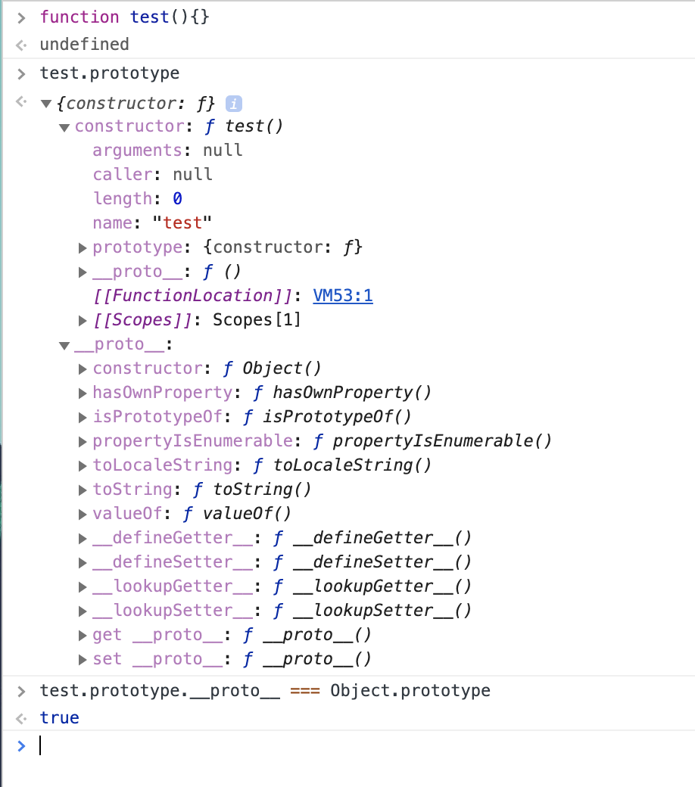

# redux介绍

> [阮一峰老师的扫盲](http://www.ruanyifeng.com/blog/2016/09/redux_tutorial_part_one_basic_usages.html)

- state

  整个redux的数据都存在store里，而state就是store在某个时刻的快照（状态）

  `store.getState()`

- action

  状态可以被改变，action就是view发出的通知（也仅仅是通知，或是携带部分信息），是一个对象

  ```
  const action = {
  	// 必须的，作为action的标识
  	type: 'ADD_TODO',
  	// 携带的信息，用于替换redux中的数据，所以很重要
    // question：
    payload: 'Learn Redux' 
  };
  ```

  view发出action：`store.dispatch(action)`

- reducer

  通过收到的action和旧的state，计算出新的state（说成更新state不太好，理由如下）

  > 阮一峰老师：
  >
  > 由于 Reducer 是纯函数，就可以保证同样的State，必定得到同样的 View。但也正因为这一点，Reducer 函数里面不能改变 State，必须返回一个全新的对象
  >
  > 最好把 State 对象设成只读。你没法改变它，要得到新的 State，唯一办法就是生成一个新对象。这样的好处是，任何时候，与某个 View 对应的 State 总是一个不变的对象。

- subscribe

  question：view发action改变state，state的改变怎么通知到所有使用了state的view呢？

  answer：view方面做出订阅：`store.subscribe`

  详见阮一峰老师的讲解

- 其他，reducer拆分，中间件（异步）啥的，请见[阮一峰：Redux 入门教程（二）：中间件与异步操作](http://www.ruanyifeng.com/blog/2016/09/redux_tutorial_part_two_async_operations.html)

有关redux的介绍这里就不再赘述，阮一峰老师讲解的很好，想看一些精简demo请移步[redux源码](https://github.com/reduxjs/redux)，上面不仅贴了各类examples还有疑难解答甚至心路历程，是我碰到过的最亲切的源码了:book:

想要了解redux起源的同学可以去参考flux或是github上开发者资料，例如这哥们[acdlite](https://github.com/acdlite)

# react-redux源码

枯燥过程开始:weary:，还是前面抄的爽

fork源码进行逐行分析，这里列出一些faq

`src/index.ts:`

```typescript
/*
 * This is a dummy function to check if the function name has been altered by minification.
 * If the function has been minified and NODE_ENV !== 'production', warn the user.
 */
function isCrushed() {}

if (
  process.env.NODE_ENV !== 'production' &&
  typeof isCrushed.name === 'string' &&
  isCrushed.name !== 'isCrushed'
) {
  warning(
    'You are currently using minified code outside of NODE_ENV === "production". ' +
      'This means that you are running a slower development build of Redux. ' +
      'You can use loose-envify (https://github.com/zertosh/loose-envify) for browserify ' +
      'or setting mode to production in webpack (https://webpack.js.org/configuration/mode/) ' +
      'to ensure you have the correct code for your production build.'
  )
}
```

emm，具体涉及代码压缩啥的，我个人还是比较好奇`isCrushed.name`是哪来的

