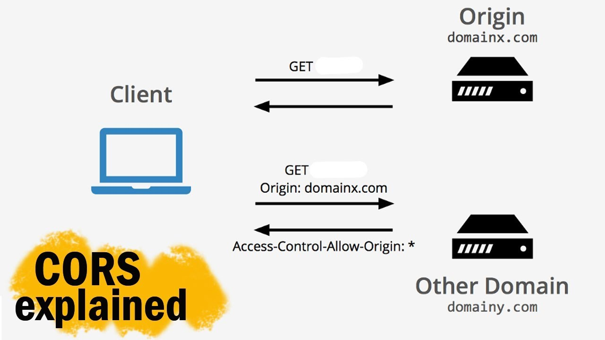
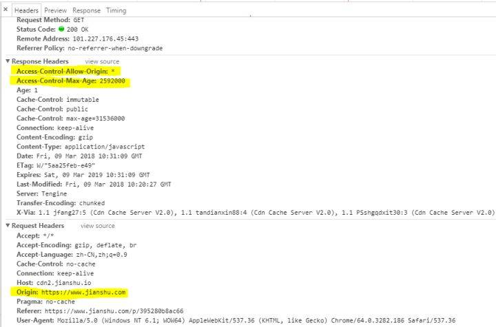
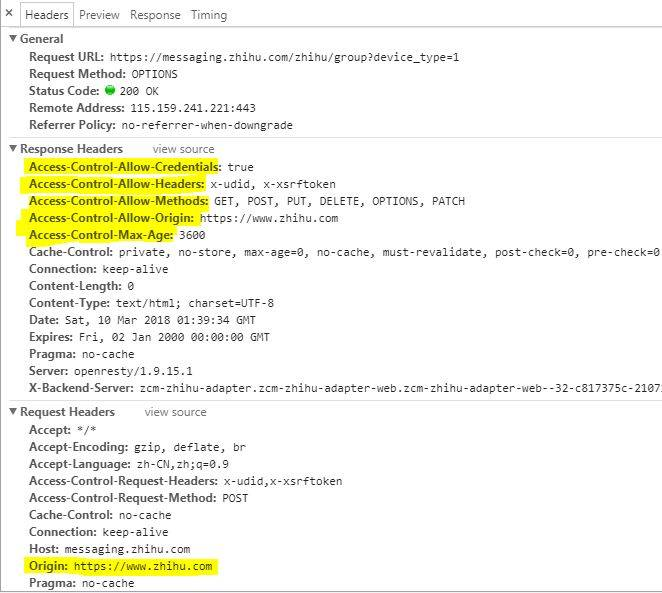

> https://juejin.im/post/6844903838621630477

“CORS” stands for **C**ross-**O**rigin **R**esource **S**haring. It allows you to make requests from one website to another website in the browser, which is normally prohibited by another browser policy called the Same-Origin Policy (SOP)

The specific browser vulnerability that Same Origin Policy is meant to address is called “cross-site request forgery” (CSRF, or alternatively XSRF, don’t you love all these acronyms?).

Before browsers implemented SOP, malicious websites were able to exploit cookies (see: [what are cookies?](http://www.pctools.com/security-news/what-are-browser-cookies/) here) stored by your browser to make unauthorized requests to other domains. Some of these unauthorized requests could do things like make purchases, delete user information, fetch sensitive data, etc. 😱

As an example, you might go to a banking website and provide some credentials to log into your account. Your username is stored in a secure browser cookie for a certain period of time so the bank can tell you are still logged in instead of having you login another time with each page you access. That’s nice!

Later on, you go to an innocent-seeming webpage listing some facts about bunnies. Unbeknownst to you, the webpage’s HTML also has a little Javascript script to make an AJAX request (see: [XMLHttpRequest](https://developer.mozilla.org/en-US/docs/Web/API/XMLHttpRequest)) to the previous banking website to make a wire transaction to another account. Because your session is still authenticated with the cookie that was stored earlier, the banking website thinks it’s just you clicking on a link on their site to submit a wire transaction. Oh no!

The easy fix for browsers was to detect when a request is made from one website to another and prevent the response from being readable. This is the Same-Origin Policy(SOP).

## Simple requests

> TODO: figure out what exactly simple || preflight request

To instruct the browser to expose server responses to a HTTP requests from certain origin, the web server must respond to the request with an additional HTTP response header, ‘Access-Control-Allow-Origin: <origin>’. Alternatively, the web server may expose its responses to all origins by specifying a value of ‘*’, e.g. ‘Access-Control-Allow-Origin: *’.

## Preflight requests

This might be sufficient for simple GET, HEAD, or POST requests without any special http headers. However, for DELETE and PUT request, ‘unsafe’ requests which may impact the server’s data, or GET, HEAD and POST requests with customized headers, the browser will send a “preflight” request to find out the CORS result prior to sending the actual request (only if the preflight response determines access is permitted).

The preflight request is an OPTIONS request made to the same HTTP path as the actual request, with a couple of HTTP headers:

- Origin — The origin header that would be included with the actual request being made by the website.
- Access-Control-Request-Method — The method of the actual request being made by the website.
- Access-Control-Request-Headers — A comma-separated list of headers that would be included in the actual request.

Web servers that wish to support CORS requests must respond to preflight requests with the following HTTP headers:

- Access-Control-Allow-Origin — The whitelisted origin, or ‘*’
- Access-Control-Allow-Methods — A comma-separated list of HTTP methods the web server wishes to permit for cross-origin requests
- Access-Control-Allow-Headers — A comma-separated list of HTTP headers the web server wishes to permit for cross-origin requests

If any of the information in the response headers does not match the actual parameters of the request, the browser will not send the actual request, preventing unwanted side-effects from the server receiving the cross-origin request. (After all, including ‘Access-Control-Allow-Origin’ in the response to any of the other requests does not prevent those requests from being made to the server; it only prevents the browser from displaying the response.)

There are more CORS headers the server may respond with, including ‘Access-Control-Expose-Headers’, ‘Access-Control-Max-Age’, and ‘Access-Control-Allow-Credentials’. Rather than go into too much detail, I would encourage you to take a look at [MDN’s detailed article about CORS](https://developer.mozilla.org/en-US/docs/Web/HTTP/Access_control_CORS) (examples of HTTP requests/responses included!) and the meaning of each header.